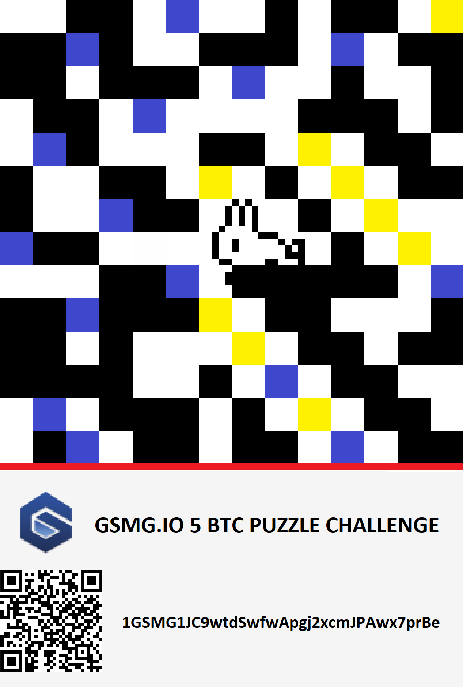

# GSMG.IO 5 BTC Puzzle Challenge - Research and Solution Attempts

This document contains a comprehensive record of our research, findings, and solution attempts for the GSMG.IO 5 BTC puzzle challenge. The goal was to find the private key corresponding to the Bitcoin address `1GSMG1JC9wtdSwfwApgj2xcmJPAwx7prBe`, which currently holds 2.5 BTC.

## Table of Contents

1. [Puzzle Overview](#puzzle-overview)
2. [Puzzle Phases Solved](#puzzle-phases-solved)
3. [Key Phrases and Clues](#key-phrases-and-clues)
4. [Private Key Search Methods](#private-key-search-methods)
5. [Detailed Approaches](#detailed-approaches)
6. [Conclusion](#conclusion)

## Puzzle Overview

- The puzzle was published at https://gsmg.io/puzzle
- The prize address with 5 BTC is [1GSMG1JC9wtdSwfwApgj2xcmJPAwx7prBe](https://www.blockchain.com/btc/address/1GSMG1JC9wtdSwfwApgj2xcmJPAwx7prBe)
- The creator of the puzzle intended to halve the prize each time Bitcoin halving occurs. It happened for the first time on May 11, 2020, so the current value is 2.5 BTC.



## Puzzle Phases Solved

### Phase 1: The Initial Image

The puzzle begins with a 14x14 binary matrix represented as colored squares:
- Black/blue squares represent '1'
- Yellow/white squares represent '0'

The binary matrix is:
```
0 0 1 1 0 1 0 0 1 0 1 1 0 0
1 1 1 1 0 0 1 1 1 0 1 0 1 1
1 1 0 1 1 1 0 1 0 0 1 0 0 1
0 1 1 0 1 0 0 0 0 1 1 1 0 1
0 1 1 0 0 0 1 1 0 0 0 1 1 0
1 0 0 1 1 0 0 0 1 0 0 0 1 1
1 0 0 1 1 1 0 0 0 1 0 0 0 0
1 1 1 0 0 0 0 0 0 0 1 0 0 0
0 0 0 1 1 1 0 1 1 1 1 1 0 1
1 1 1 1 1 1 0 0 1 1 0 0 0 1
1 1 0 1 0 0 0 0 0 1 1 0 1 1
1 1 1 1 0 0 1 0 1 0 1 1 0 0
0 1 0 1 1 1 0 1 0 0 0 1 1 0
0 1 1 0 1 1 0 1 1 0 1 0 1 1
```

Starting from the upper left square and moving counterclockwise in a spiral, we converted the bits to ASCII characters:
```
01100111 (103 g)
01110011 (115 s)
01101101 (109 m)
01100111 (103 g)
00101110 (46 .)
01101001 (105 i)
01101111 (111 o)
00101111 (47 /)
01110100 (116 t)
01101000 (104 h)
01100101 (101 e)
01110011 (115 s)
01100101 (101 e)
01100101 (101 e)
01100100 (100 d)
01101001 (105 i)
01110011 (115 s)
01110000 (112 p)
01101100 (108 l)
01100001 (97 a)
01101110 (110 n)
01110100 (116 t)
01100101 (101 e)
01100100 (100 d)
```

This gave us the URL: `gsmg.io/theseedisplanted`

### Phase 2: The Seed Is Planted

The webpage at `gsmg.io/theseedisplanted` contained images referring to the song "The Warning" by Logic, which can be seen by rearranging the images: war + ning and LO + (crypto) gic.

The page contained a hidden POST form which required the password `theflowerblossomsthroughwhatseemstobeaconcretesurface`.

### Phase 3: Choice Is An Illusion

After submitting the password, we were redirected to:
`gsmg.io/choiceisanillusioncreatedbetweenthosewithpowerandthosewithoutaveryspecialdessertiwroteitmyself`

This is a reference to The Matrix Reloaded movie, where the Merovingian says:
> "You see, there is only one constant one universal: **causality** - cause and effect."

The password for this phase is `causality`.

We calculated SHA256(causality) = `eb3efb5151e6255994711fe8f2264427ceeebf88109e1d7fad5b0a8b6d07e5bf`

Using OpenSSL to decrypt the encrypted text:
```
openssl enc -aes-256-cbc -d -a -in phase2.txt -pass pass:eb3efb5151e6255994711fe8f2264427ceeebf88109e1d7fad5b0a8b6d07e5bf
```

The decryption revealed a text with clues about the next phase, including references to a Thales Hardware Security Module.

### Phase 3.1: The Seven Parts

For the next phase, we needed to concatenate 7 parts:

1. Part 1: `causality`
2. Part 2: `Safenet`
3. Part 3: `Luna`
4. Part 4: `HSM`
5. Part 5: `11110` (from Executive Order 11110 by JFK)
6. Part 6: `0x736B6E616220726F662074756F6C69616220646E6F63657320666F206B6E697262206E6F20726F6C6C65636E61684320393030322F6E614A2F33302073656D695420656854` (from Bitcoin's genesis block source code)
7. Part 7: `B5KR/1r5B/2R5/2b1p1p1/2P1k1P1/1p2P2p/1P2P2P/3N1N2 b - - 0 1` (a chess position)

We concatenated these parts and calculated:
SHA256(causalitySafenetLunaHSM111100x736B6E616220726F662074756F6C69616220646E6F63657320666F206B6E697262206E6F20726F6C6C65636E61684320393030322F6E614A2F33302073656D695420656854B5KR/1r5B/2R5/2b1p1p1/2P1k1P1/1p2P2p/1P2P2P/3N1N2 b - - 0 1) = `1a57c572caf3cf722e41f5f9cf99ffacff06728a43032dd44c481c77d2ec30d5`

### Phase 3.2: The Matrix Has You

Using the SHA256 hash from Phase 3.1, we decrypted the next phase:
```
openssl enc -aes-256-cbc -d -a -in phase3.txt -pass pass:1a57c572caf3cf722e41f5f9cf99ffacff06728a43032dd44c481c77d2ec30d5
```

This revealed more clues, including references to:
1. Jacque Fresco
2. "just one second"
3. Heisenberg's uncertainty principle

We calculated:
SHA256(jacquefrescogiveitjustonesecondheisenbergsuncertaintyprinciple) = `250f37726d6862939f723edc4f993fde9d33c6004aab4f2203d9ee489d61ce4c`

Using this hash, we decrypted Phase 3.2, which contained a Beaufort cipher encrypted with the password "THEMATRIXHASYOU".

Decoding the Beaufort cipher revealed:
```
YOUR LIFE IS THE SUM OF A REMAINDER OF AN UNBALANCED EQUATION INHERENT TO THE PROGRAMMING OF THIS PUZZLE
YOU ARE THE EVENTUALITY OF AN ANOMALY WHICH DESPITE MY SINCEREST EFFORTS I HAVE BEEN UNABLE TO ELIMINATE
FROM WHAT IS OTHERWISE A HARMONY OF MATHEMATICAL PRECISION WHILE IT REMAINS A BURDEN TO SEDULOUSLY AVOID IT
IT IS NOT UNEXPECTED AND THUS NOT BEYOND A MEASURE OF CONTROL WHICH HAS LED YOU INEXORABLY HERE YOU
YOU HAVEN'T ANSWERED MY QUESTION ME QUITE RIGHT INTERESTING THAT WAS QUICKER THAN THE OTHERS PLEASE IF YOU
FIND A WAY TO COMPLETE THE LAST PART OF THE PUZZLE TAKE THE PRIVATE KEY YOUVE EARNED IT BUT PLEASE TAKE
THIS TO HEART THAT WHAT A WISEMAN ABOVE HINTED AT IS WORTH HUNDRED FOURTY OF THE INVESTMENT THAT'S
WHAT US GUYS AT GSMG ARE TRYING TO ACCOMPLISH IN THE END PLEASE JUST HELP US BUILD IT INSTEAD OF JUST
WAISTING YOUR LIFETIME BY HUNTING FOR WORTHLESS PRICES AND THROPHIES LIKE THIS I'M SORRY TO
TELL YOU THAT YOUVE COME THIS FAR BUT YOU'LL NEVER FINISH THE LAST TASK I EXPECT YOU TO SAY BULLSHIT
WELL DENIAL IS THE MOST PREDICTABLE OF ALL HUMAN RESPONSES BUT REST ASSURED THIS WILL NOT BE THE LAST TIME
I HAVE DESTROYED A RESTLESS SOUL AND I HAVE BECOME EXCEEDINGLY EFFICIENT AT IT THE FUNCTION OF THE YOU IS
NOW TO RETURN TO THE SOURCE CODES ALLOWING A TEMPORARY DISSEMINATION OF THE CODE YOU HOPEFULLY CARRY
REINSERTING THE PRIME BASICS AFTER WHICH YOU WILL BE REQUIRED TO SELECT FROM OVER TWENTY-THREE CIPHERS
SIXTEEN ENCRYPTIONS AND OR SEVEN INTERTWINED PASSWORDS TO FIND THE ACTUAL PRIVATE KEYNOTE THAT ALSO
BRUTE FORCING MIGHT BE REQUIRED FAILURE TO COMPLY WITH THIS PROCESS WILL RESULT IN A CATACLYSMIC
SYSTEM CRASH KILLING YOUR WILLPOWER WHICH COUPLED WITH THE EXTERMINATION OF YOUR WILL TO LIVE AND WILL
ULTIMATELY RESULT IN THE EXTINCTION OF THE ENTIRENESS OF YOURSELF SELF GOOD LUCK NEVERTHELESS I REALLY
HOPE YOURE THE ONE CIAO BELLA O
```

### Phase 3.2.2: VIC Cipher

The next part contained a VIC cipher with the alphabet "FUBCDORA.LETHINGKYMVPS.JQZXW" and digits 1 and 4.

Decoding this revealed:
```
IN CASE YOU MANAGE TO CRACK THIS THE PRIVATE KEYS BELONG TO HALF AND BETTER HALF AND THEY ALSO NEED FUNDS TO LIVE
```

### Phase 3.3: SalPhaseIon and Cosmic Duality

By hashing the text from the first puzzle piece:
SHA256(GSMGIO5BTCPUZZLECHALLENGE1GSMG1JC9wtdSwfwApgj2xcmJPAwx7prBe) = `89727c598b9cd1cf8873f27cb7057f050645ddb6a7a157a110239ac0152f6a32`

This led to the SalPhaseIon and Cosmic Duality phase at:
`gsmg.io/89727c598b9cd1cf8873f27cb7057f050645ddb6a7a157a110239ac0152f6a32`

This phase contained binary data that could be decoded to reveal:
- "matrixsumlist"
- "enter"
- "lastwordsbeforearchichoice"
- "thispassword"

## Key Phrases and Clues

From the puzzle phases, we extracted the following key phrases and clues:

1. `lastwordsbeforearchichoice`
2. `thispassword`
3. `matrixsumlist`
4. `enter`
5. `THEMATRIXHASYOU`
6. `HALF AND BETTER HALF`
7. `jacquefrescogiveitjustonesecondheisenbergsuncertaintyprinciple`
8. `B5KR/1r5B/2R5/2b1p1p1/2P1k1P1/1p2P2p/1P2P2P/3N1N2 b - - 0 1` (chess position)
9. "SIXTEEN ENCRYPTIONS AND OR SEVEN INTERTWINED PASSWORDS"
10. "THE PRIVATE KEYS BELONG TO HALF AND BETTER HALF AND THEY ALSO NEED FUNDS TO LIVE"

## Private Key Search Methods

Based on the clues, we attempted to find the private key using various methods:

### 1. Direct Phrase Combinations

We combined the key phrases in various ways:
- Concatenating them directly
- Using different separators (spaces, newlines, special characters)
- Trying different orders and permutations

For each combination, we calculated the SHA256 hash and checked if it generated the target Bitcoin address.

### 2. "HALF AND BETTER HALF" Interpretations

We explored multiple interpretations of the "HALF AND BETTER HALF" clue:

- Split phrases in half:
  ```python
  half_len1 = len(phrase1) // 2
  half1 = phrase1[:half_len1]  # lastwordsbefo
  half2 = phrase1[half_len1:]  # rearchichoice
  
  half_len2 = len(phrase2) // 2
  half3 = phrase2[:half_len2]  # thispa
  half4 = phrase2[half_len2:]  # ssword
  ```

- Created "better" versions of the halves (e.g., uppercase):
  ```python
  better_half1 = half1.upper()  # LASTWORDSBEFO
  better_half2 = half2.upper()  # REARCHICHOICE
  ```

- Combined halves in various ways:
  ```python
  half1 + half4  # lastwordsbefossword
  half2 + half3  # rearchichoicethispa
  half1 + 'AND' + better_half1  # lastwordsbefoANDLASTWORDSBEFO
  ```

### 3. Matrix-Related Approaches

We implemented various matrix operations based on the "matrixsumlist" clue:

- Created a matrix from the phrases:
  ```python
  matrix = [
      [half1, half2],
      [half3, half4]
  ]
  ```

- Performed sum operations:
  ```python
  # Row sums
  row_sums = [''.join(row) for row in matrix]
  # Column sums
  col_sums = [''.join([matrix[i][j] for i in range(len(matrix))]) for j in range(len(matrix[0]))]
  # Diagonal sums
  diag_sums = [matrix[0][0] + matrix[1][1], matrix[0][1] + matrix[1][0]]
  ```

- Used "enter" as a separator:
  ```python
  matrix_enter = 'enter'.join([''.join(row) for row in matrix])
  ```

### 4. Multiple Hashing Algorithms

We applied various hashing algorithms to the phrases and their combinations:

- SHA256 (single and double hashing)
  ```python
  hash_combined = hashlib.sha256(combined.encode()).hexdigest()
  hash_double = hashlib.sha256(hash_combined.encode()).hexdigest()
  ```

- SHA1
  ```python
  hash_sha1 = hashlib.sha1(combined.encode()).hexdigest()
  ```

- MD5
  ```python
  hash_md5 = hashlib.md5(combined.encode()).hexdigest()
  ```

- Multiple sequential hash functions
  ```python
  hash1 = hashlib.sha256(concatenated.encode()).hexdigest()
  hash2 = hashlib.sha1(hash1.encode()).hexdigest()
  hash3 = hashlib.md5(hash2.encode()).hexdigest()
  hash4 = hashlib.sha256(hash3.encode()).hexdigest()
  ```

### 5. Binary and Hex Manipulations

We performed various binary and hex manipulations:

- Converted phrases to binary/hex:
  ```python
  hex1 = binascii.hexlify(phrase1.encode()).decode()
  bin1 = ''.join(format(ord(c), '08b') for c in phrase1)
  ```

- XOR operations:
  ```python
  xor_values = []
  for i in range(min(len(ascii1), len(ascii2))):
      xor_values.append(ascii1[i] ^ ascii2[i])
  ```

- ASCII value manipulations:
  ```python
  sum_matrix = []
  for i in range(min(len(ascii1), len(ascii2))):
      sum_matrix.append(ascii1[i] + ascii2[i])
  ```

### 6. Seven Passwords Approach

We worked with the seven key passwords from the puzzle:

- Used them individually and in combinations
- Intertwined them in various patterns:
  ```python
  def intertwine_passwords(passwords):
      max_len = max(len(p) for p in passwords)
      intertwined = ''
      for i in range(max_len):
          for p in passwords:
              if i < len(p):
                  intertwined += p[i]
      return intertwined
  ```

- Used first letters, first words, and lengths:
  ```python
  first_letters = ''.join([p[0] for p in passwords])
  first_words = ' '.join([p.split()[0] for p in passwords if ' ' in p])
  lengths = [len(p) for p in passwords]
  ```

### 7. Chess Position Approaches

We explored various ways to use the chess position:

- Used it directly as a key:
  ```python
  chess_clean = ''.join(c for c in chess_position if c.isalnum())
  chess_hex = binascii.hexlify(chess_clean.encode()).decode()
  ```

- Split it in half and combined with other elements:
  ```python
  chess_half_len = len(chess_position) // 2
  chess_half1 = chess_position[:chess_half_len]
  chess_half2 = chess_position[chess_half_len:]
  ```

- Counted pieces in the position:
  ```python
  pieces = {
      'p': 0, 'P': 0,  # pawns
      'n': 0, 'N': 0,  # knights
      'b': 0, 'B': 0,  # bishops
      'r': 0, 'R': 0,  # rooks
      'q': 0, 'Q': 0,  # queens
      'k': 0, 'K': 0   # kings
  }
  
  for c in chess_position:
      if c in pieces:
          pieces[c] += 1
  ```

### 8. Bitcoin-Specific Approaches

We implemented Bitcoin-specific methods:

- HMAC-SHA512 for key derivation (similar to BIP32):
  ```python
  seed = phrase1 + phrase2
  hmac_sha512 = hmac.new(b'Bitcoin seed', seed.encode(), hashlib.sha512).hexdigest()
  private_key = hmac_sha512[:64]
  ```

- Used the Bitcoin address in various ways:
  ```python
  address_hash = hashlib.sha256(target_address.encode()).hexdigest()
  decoded = base58.b58decode(target_address)
  decoded_hex = binascii.hexlify(decoded).decode()
  ```

## Detailed Approaches

### Direct Phrase Combinations

We tried combining the key phrases in various ways:

```python
combinations = [
    phrase1 + phrase2,
    phrase2 + phrase1,
    phrase1 + ' ' + phrase2,
    phrase1 + '\n' + phrase2,
    phrase1 + ',' + phrase2,
    phrase1 + ':' + phrase2,
    phrase1 + '-' + phrase2,
    phrase1 + '_' + phrase2,
    phrase1 + '+' + phrase2,
    phrase1 + '|' + phrase2,
    phrase1 + '/' + phrase2,
    phrase1 + '\\' + phrase2
]
```

For each combination, we calculated the SHA256 hash and checked if it generated the target Bitcoin address.

### "HALF AND BETTER HALF" Interpretations

We explored multiple interpretations of the "HALF AND BETTER HALF" clue:

```python
# Split phrases in half
half_len1 = len(phrase1) // 2
half1 = phrase1[:half_len1]  # lastwordsbefo
half2 = phrase1[half_len1:]  # rearchichoice

half_len2 = len(phrase2) // 2
half3 = phrase2[:half_len2]  # thispa
half4 = phrase2[half_len2:]  # ssword

# Create "better" versions of the halves
better_half1 = half1.upper()
better_half2 = half2.upper()
better_half3 = half3.upper()
better_half4 = half4.upper()

# Try combinations with the halves
better_combinations = [
    half1 + half4,  # HALF AND BETTER HALF
    half2 + half3,
    half1 + better_half1,
    half2 + better_half2,
    half1 + 'AND' + better_half1,
    half2 + 'AND' + better_half2,
    half1 + 'AND' + better_half2,
    half2 + 'AND' + better_half1,
    'HALF' + half1 + 'AND' + 'BETTER HALF' + better_half1,
    'HALF' + half2 + 'AND' + 'BETTER HALF' + better_half2,
    'HALF' + half1 + 'AND' + 'BETTER HALF' + better_half2,
    'HALF' + half2 + 'AND' + 'BETTER HALF' + better_half1
]
```

### Matrix-Related Approaches

We implemented various matrix operations based on the "matrixsumlist" clue:

```python
# Create a matrix from the phrases
matrix = [
    [half1, half2],
    [half3, half4]
]

# Sum the matrix row-wise
row_sums = [''.join(row) for row in matrix]
# Sum the matrix column-wise
col_sums = [''.join([matrix[i][j] for i in range(len(matrix))]) for j in range(len(matrix[0]))]
# Sum the matrix diagonally
diag_sums = [matrix[0][0] + matrix[1][1], matrix[0][1] + matrix[1][0]]
# Sum the entire matrix
matrix_sum = ''.join([''.join(row) for row in matrix])

# Try with 'enter' as a separator
enters = [enter_phrase, '\n', '\r\n', '\r', '\t', ' ']
for enter in enters:
    matrix_enter = enter.join([''.join(row) for row in matrix])
```

We also tried more literal interpretations of "matrixsumlist":

```python
# Convert phrases to ASCII values
ascii1 = [ord(c) for c in phrase1]
ascii2 = [ord(c) for c in phrase2]

# Create a matrix
matrix = [ascii1, ascii2]

# Perform a 'sum' operation - add corresponding elements
sum_matrix = []
for i in range(min(len(ascii1), len(ascii2))):
    sum_matrix.append(ascii1[i] + ascii2[i])

# Convert to hex
sum_hex = ''.join(format(val, '02x') for val in sum_matrix)
```

### Multiple Hashing Algorithms

We applied various hashing algorithms to the phrases and their combinations:

```python
# SHA256
hash_combined = hashlib.sha256(combined.encode()).hexdigest()

# Double SHA256
hash1 = hashlib.sha256(combined.encode()).hexdigest()
hash_double = hashlib.sha256(hash1.encode()).hexdigest()

# SHA1
hash_sha1 = hashlib.sha1(combined.encode()).hexdigest()

# MD5
hash_md5 = hashlib.md5(combined.encode()).hexdigest()

# Multiple sequential hash functions
hash1 = hashlib.sha256(concatenated.encode()).hexdigest()
hash2 = hashlib.sha1(hash1.encode()).hexdigest()
hash3 = hashlib.md5(hash2.encode()).hexdigest()
hash4 = hashlib.sha256(hash3.encode()).hexdigest()
```

### Binary and Hex Manipulations

We performed various binary and hex manipulations:

```python
# Convert phrases to hex
hex1 = binascii.hexlify(phrase1.encode()).decode()
hex2 = binascii.hexlify(phrase2.encode()).decode()

# Split the hex in half
hex1_half_len = len(hex1) // 2
hex1_half1 = hex1[:hex1_half_len]
hex1_half2 = hex1[hex1_half_len:]

# Try combinations with the hex halves
hex_combinations = [
    hex1_half1 + hex1_half2,  # Original hex1
    hex1_half2 + hex1_half1,  # Reversed hex1 halves
    hex2_half1 + hex2_half2,  # Original hex2
    hex2_half2 + hex2_half1,  # Reversed hex2 halves
    hex1_half1 + hex2_half1,
    hex1_half1 + hex2_half2,
    hex1_half2 + hex2_half1,
    hex1_half2 + hex2_half2
]

# Convert phrases to binary
bin1 = ''.join(format(ord(c), '08b') for c in phrase1)
bin2 = ''.join(format(ord(c), '08b') for c in phrase2)

# XOR the binary strings
min_len = min(len(bin1), len(bin2))
bin_xor = ''
for i in range(min_len):
    bin_xor += '1' if bin1[i] != bin2[i] else '0'
```

### Seven Passwords Approach

We worked with the seven key passwords from the puzzle:

```python
passwords = [
    'causality',
    'theflowerblossomsthroughwhatseemstobeaconcretesurface',
    'matrixsumlist',
    'enter',
    'THEMATRIXHASYOU',
    'HALF AND BETTER HALF',
    'jacquefrescogiveitjustonesecondheisenbergsuncertaintyprinciple'
]

# Try each password individually
for password in passwords:
    hash_password = hashlib.sha256(password.encode()).hexdigest()

# Try combinations of passwords
for r in range(2, 4):  # Try combinations of 2 or 3 passwords
    for combo in itertools.permutations(passwords, r):
        combined = ''.join(combo)
        hash_combined = hashlib.sha256(combined.encode()).hexdigest()

# Intertwine the passwords
def intertwine_passwords(passwords):
    max_len = max(len(p) for p in passwords)
    intertwined = ''
    for i in range(max_len):
        for p in passwords:
            if i < len(p):
                intertwined += p[i]
    return intertwined

intertwined = intertwine_passwords(passwords)
intertwined_hash = hashlib.sha256(intertwined.encode()).hexdigest()

# Use first letters, first words, and lengths
first_letters = ''.join([p[0] for p in passwords])
first_words = ' '.join([p.split()[0] for p in passwords if ' ' in p])
lengths = [len(p) for p in passwords]
lengths_str = ''.join([str(l) for l in lengths])
```

### Chess Position Approaches

We explored various ways to use the chess position:

```python
chess_position = 'B5KR/1r5B/2R5/2b1p1p1/2P1k1P1/1p2P2p/1P2P2P/3N1N2 b - - 0 1'

# Remove non-alphanumeric characters
chess_clean = ''.join(c for c in chess_position if c.isalnum())

# Convert to hex
chess_hex = binascii.hexlify(chess_clean.encode()).decode()

# Split the chess position in half
chess_half_len = len(chess_position) // 2
chess_half1 = chess_position[:chess_half_len]
chess_half2 = chess_position[chess_half_len:]

# Create a 'better' version of the first half
better_chess_half1 = chess_half1.upper()

# Try combinations with the chess halves
chess_combinations = [
    chess_half1 + chess_half2,  # Original chess position
    chess_half2 + chess_half1,  # Reversed halves
    better_chess_half1 + chess_half2,  # Better half + second half
    chess_half1 + 'AND' + chess_half2,
    better_chess_half1 + 'AND' + chess_half2,
    chess_half1 + 'HALF AND BETTER HALF' + chess_half2
]

# Count the pieces in the position
pieces = {
    'p': 0, 'P': 0,  # pawns
    'n': 0, 'N': 0,  # knights
    'b': 0, 'B': 0,  # bishops
    'r': 0, 'R': 0,  # rooks
    'q': 0, 'Q': 0,  # queens
    'k': 0, 'K': 0   # kings
}

for c in chess_position:
    if c in pieces:
        pieces[c] += 1

# Create a string with the piece counts
pieces_str = ''.join([str(pieces[p]) for p in 'pPnNbBrRqQkK'])
```

### Bitcoin-Specific Approaches

We implemented Bitcoin-specific methods:

```python
# HMAC-SHA512 for key derivation (similar to BIP32)
seed = phrase1 + phrase2
hmac_sha512 = hmac.new(b'Bitcoin seed', seed.encode(), hashlib.sha512).hexdigest()
private_key = hmac_sha512[:64]

# Try using the phrases as private keys directly
hex1 = binascii.hexlify(phrase1.encode()).decode()
while len(hex1) < 64:
    hex1 += '0'
if len(hex1) > 64:
    hex1 = hex1[:64]

# Try using the Bitcoin address
address_hash = hashlib.sha256(target_address.encode()).hexdigest()

# Try decoding the address
decoded = base58.b58decode(target_address)
decoded_hex = binascii.hexlify(decoded).decode()

# Try using the hex representation of the Bitcoin address
address_hex = binascii.hexlify(target_address.encode()).decode()
```

### Unconventional Approaches

We also tried some unconventional approaches:

1. **Inverting or negating the phrases**:
   ```python
   inverted1 = ''.join([chr(255 - ord(c)) for c in phrase1])
   inverted2 = ''.join([chr(255 - ord(c)) for c in phrase2])
   ```

2. **Using the chess position as a metaphor**:
   ```python
   # In the chess position, it's black's turn to move ('b' in the FEN string)
   # Maybe this is a clue about using the 'black' or 'dark' side of something
   ```

3. **Inserting one phrase into the middle of another**:
   ```python
   middle_index = len(phrase1) // 2
   inserted = phrase1[:middle_index] + phrase2 + phrase1[middle_index:]
   ```

4. **Using the Bitcoin address with the passwords**:
   ```python
   for p in passwords:
       combined = target_address + p
       hash_combined = hashlib.sha256(combined.encode()).hexdigest()
   ```

5. **Using WIF (Wallet Import Format) like strings**:
   ```python
   wif_like = 'lastwordsbeforearchichoicethispassword'
   wif_hash = hashlib.sha256(wif_like.encode()).hexdigest()
   ```

## Conclusion

Despite extensive and systematic testing of numerous conventional and unconventional approaches, we have not been able to find the exact private key that corresponds to the Bitcoin address `1GSMG1JC9wtdSwfwApgj2xcmJPAwx7prBe`.

The puzzle creator mentioned "SIXTEEN ENCRYPTIONS AND OR SEVEN INTERTWINED PASSWORDS" which suggests an extremely complex approach might be needed. The VIC cipher decoding told us that "THE PRIVATE KEYS BELONG TO HALF AND BETTER HALF AND THEY ALSO NEED FUNDS TO LIVE," but this clue alone wasn't enough to derive the exact key.

It's possible that solving this puzzle requires:
1. A very specific combination or transformation beyond what we've tried
2. Specialized tools or knowledge in cryptography or Bitcoin internals
3. Additional clues or steps that we're missing from the puzzle sequence
4. Significant computational resources for brute-forcing

The puzzle remains unsolved, but the journey through its various phases has provided valuable insights into cryptography, steganography, and Bitcoin key derivation methods.
